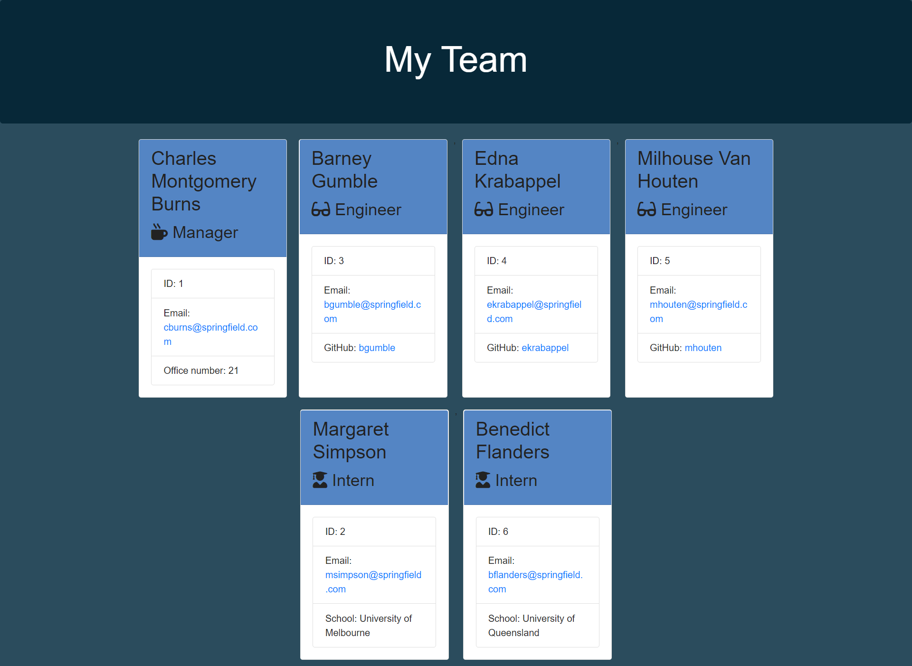

   
   
   
   
   
   
  

  # Welcome to Team Page Generator

  ## Table of Contents

  * [Description](#Description)
  * [Demonstration](#Demonstration)
  * [Setup](#Setup)
  * [Usage](#Usage)
  * [License](#License)
  * [Contributions](#Contributions)
  * [Version](#Version)
  * [Tests](#Tests)
  * [Questions](#Questions)

  ## Description

  This application allows a user to generate a web-page for their team which will display each team member's role and contact information. The project uses the npm inquirer package and node.js to prompt the user to enter information about their team via the terminal. It also demonstrates the use of classes and object-oriented programming in javascript to make code more manageable and reusable. The information provided by the user is dynamically rendered into an html page that can be published on the company website. The page is styled and made responsive using the bootstrap framework.

  ## Demonstration

  View a live demonstration [here](https://youtu.be/m_QH2Y52wDQ).

  #### A screenshot of the generated web page

  

  ## Setup

  Use git clone with either HTTPS or SSH key (if you have it set up) to clone the repository. Run 'npm install' to install required packages.

  ## Usage

  When working on terminal in the application directory, type 'node index.js'. The user will then receive a series of prompts corresponding to the sections of the readme document.

  ## License

  

  You may utilize this application under the terms of the [MIT license](assets/licences/MIT.txt).

  ## Contributions

  If you would like to add  new features, make improvements or bug fixes, please make a pull request. I will review it and merge it into the application as necessary.

  ## Version

  

  ## Tests

  I have included tests to ensure that the classes and their methods are being accessed correctly. The tests can be run by entering 'npm run test' from the terminal in the 'develop' directory.

  ## Questions

  If you have further questions or would like to see more features, please contact me via github or email:

  https://github.com/bdcoelho 

  ben_coelho@hotmail.com

  